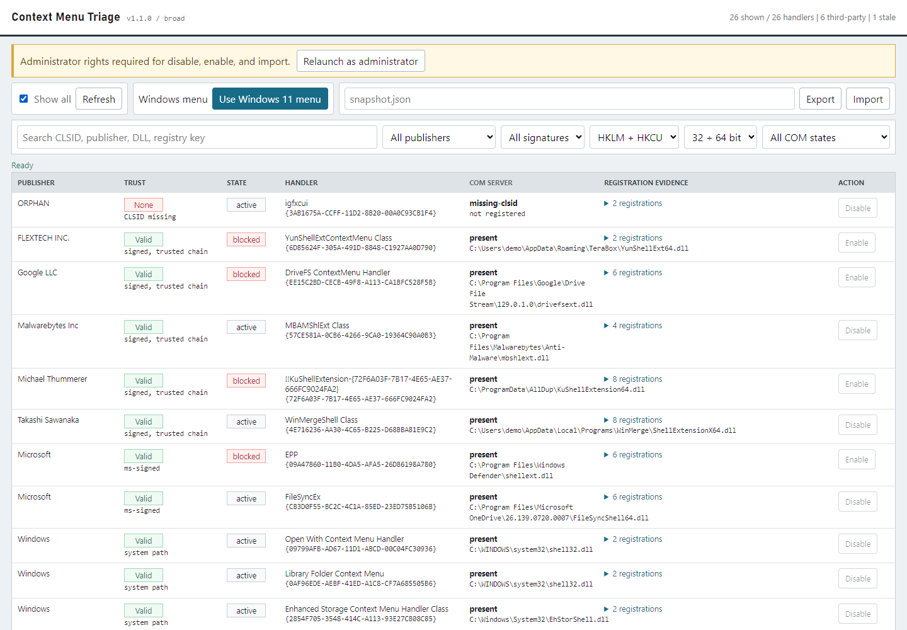
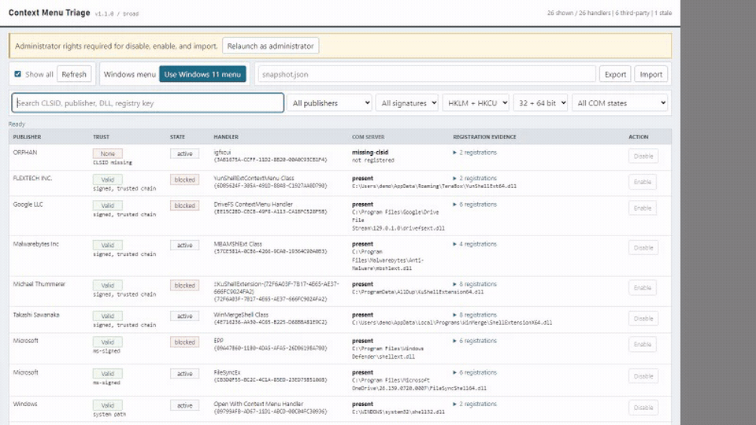

# Context Menu Triage

Inspect legacy Windows Explorer context menu handlers, verify where they came from, find stale COM registrations, and block selected handlers reversibly.

Context Menu Triage separates the evidence that matters: HKLM versus HKCU registration, 64-bit versus 32-bit registry view, COM server state, resolved DLL path, Authenticode chain status, signer, and every file-association surface that references a CLSID. It does not claim to inspect the primary Windows 11 menu, which is built around `IExplorerCommand`; legacy `IContextMenu` handlers normally appear under **Show more options** or Shift+F10.





## Install

Download `context-menu-triage.exe` from [GitHub Releases](https://github.com/mario0318/context-menu-triage/releases). The executable contains the GUI and CLI and has no runtime dependencies. Double-click it for the GUI.

From source, install Node.js 20 or newer and run:

```powershell
git clone https://github.com/mario0318/context-menu-triage.git
cd context-menu-triage
npm ci
node triage.js
```

Registry inspection is unelevated. Applying an HKLM block, unblock, or snapshot restore requires administrator rights. Classic-menu mode writes HKCU and does not require elevation.

## What It Scans

The default `--scope all` scan walks `shellex\ContextMenuHandlers` below HKLM and HKCU `Software\Classes` in the native 64-bit and 32-bit registry views. This includes per-ProgID and individual file-association handlers, not only the seven common shell surfaces. Results retain their source hive, registry view, parent, and key.

`--scope broad` is a faster compatibility scan limited to `*`, `AllFilesystemObjects`, `Directory`, `Directory\Background`, `Drive`, `Folder`, and `LibraryFolder`.

For each referenced CLSID, the tool distinguishes:

- missing CLSID registration
- CLSID present but `InprocServer32` absent
- `InprocServer32` present but DLL missing
- COM server present

A missing DLL path writable by the current user is highlighted as a potential COM hijack surface. That is a local risk indicator, not a vulnerability claim.

## CLI

```powershell
context-menu-triage list --all
context-menu-triage list --json --scope all
context-menu-triage audit --format sarif --output triage.sarif --fail-on writable-missing-path
context-menu-triage block <row-or-clsid>
context-menu-triage block <row-or-clsid> --apply --restart-explorer
context-menu-triage unblock <row-or-clsid> --apply
context-menu-triage export baseline.json
context-menu-triage import baseline.json
context-menu-triage import baseline.json --apply
context-menu-triage undo-last --apply
context-menu-triage diff before.json after.json
context-menu-triage baseline create baseline.json
context-menu-triage baseline check baseline.json
context-menu-triage classic-menu status
context-menu-triage gui --elevate
```

Mutating CLI commands are dry runs unless `--apply` is supplied. Before every applied block, unblock, or import, the tool writes an automatic rollback snapshot and records it in `%USERPROFILE%\.context-menu-triage-last-change.json` for `undo-last`.

Filters are available in the CLI and GUI: `--query`, `--publisher`, `--signature`, `--hive`, `--view`, `--state`, and `--blocked yes|no`. Audit output supports JSON, CSV, and SARIF for inventory and baseline workflows.

Snapshot schema v2 is published at [`docs/snapshot.schema.json`](docs/snapshot.schema.json). Legacy array snapshots from v1 remain importable.

## Trust Model

`trusted` means `Get-AuthenticodeSignature` returned `Valid`, which includes certificate-chain validation. A signature blob, self-signed certificate, expired chain, hash mismatch, or unknown error is not treated as trusted.

Windows classification is path first because catalog-signed system DLLs can be valid while exposing no leaf signer certificate. A DLL under `%SystemRoot%` is treated as Windows unless a valid non-Microsoft signer proves otherwise. Microsoft-valid signatures are also classified as Windows. Every row includes the reason for its classification.

PowerShell still performs registry and Authenticode work underneath the Node interface. This does not bypass execution policy or constrained language mode. Node is used to provide one file for both CLI and local web UI with one consistent JSON model.

## Safety

- The only handler-disable write is a value under `HKLM\SOFTWARE\Microsoft\Windows\CurrentVersion\Shell Extensions\Blocked`.
- Handler registrations and `HKCR\CLSID` are never deleted or renamed.
- The Blocked list is documented and tested here for Explorer. Other shell-view hosts may not honor it consistently.
- Explorer is restarted only after an explicit CLI flag or GUI action.
- The GUI binds only to `127.0.0.1` and requires a random launch token on every API request.
- Applied mutations are logged locally. No telemetry or network egress is built into the program.
- Conflict entries are rejected unless they include a source. Name matches remain advisory.

## Compatibility

Automated source and live-registry tests run on Windows with Node 20, 22, and 24 in GitHub Actions. The live guard verifies a catalog-valid Windows `shell32.dll` handler, so a broken PowerShell signature-module environment fails CI. Manual development testing has covered Windows 11 25H2. Please include the Windows build, architecture, and command output in compatibility reports.

The read and dry-run surfaces are covered by automated tests. A controlled live HKLM block/unblock/import cycle should still be performed for each release candidate on a disposable third-party handler before calling the write path certified.

See [BUILD.md](BUILD.md) for the maintained implementation contract and [SECURITY.md](SECURITY.md) for reporting guidance.
